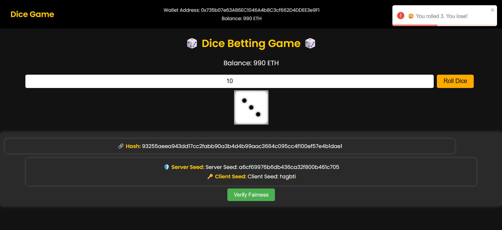

# 🎲 Provably Fair Dice Betting Game

An interactive web-based dice game built with **Parcel** (frontend) and **Node.js** (backend), demonstrating how **cryptographic fairness** can be enforced in online games. This project simulates a provably fair betting mechanism, ensuring players can verify the authenticity of every roll outcome.

---

## 📸 Demo



> A sample roll showing:
> - The bet amount
> - Dice result (3)
> - Outcome alert
> - Server hash commitment
> - Server and client seed pair
> - Fairness verification mechanism

---

## 🚀 Tech Stack

| Layer        | Tech              |
|--------------|------------------|
| Frontend     | Parcel, HTML, CSS, JavaScript |
| Backend      | Node.js, Express |
| Cryptography | SHA-256 (via `crypto` module) |

---

## 🎮 Game Logic (Provably Fair System)

This game uses **commit-reveal cryptography** to ensure no manipulation occurs on the server side.

### 🛡️ Cryptographic Commit-Reveal Scheme

1. **Commit Phase:**
   - Server generates a secure `server_seed`
   - Hash of this seed (`SHA-256`) is sent to the client before rolling

2. **Reveal Phase:**
   - Client submits a randomly generated `client_seed`
   - Server reveals the original `server_seed`

3. **Roll Calculation:**
   - Combined seeds are hashed together:  
     ```js
     const resultHash = SHA256(client_seed + server_seed);
     const diceRoll = (parseInt(resultHash.substring(0, 8), 16) % 6) + 1;
     ```

4. **Verification:**
   - Anyone can recompute the result using the provided seeds and verify that the dice roll was not manipulated.

---

## 📁 Project Structure

provably-fair-dice-game/ ├── client/ │ ├── index.html │ ├── index.js │ └── assets/ │ └── demo.png └── server/ └── index.js


---

## ⚙️ How to Run Locally

### 1. Clone the Repository

```bash
git clone https://github.com/jaydeepninawe/cryptographic_dice_game.git
cd cryptographic_dice_game
```
### 2.Install Backend Dependencies and Start Server
```bash
cd server
npm install
node index.js
```
### 3.Install Frontend Dependencies and Start Parcel Dev Server
```bash
cd ../client
npm install
npm start
```
## Access the game at: http://localhost:1234


## 📬 Contact

Built with ❤️ by **[Jaydeep Ninawe]**

- 📫 Email: `ninawejay3002@gmail.com`  
- 🌐 GitHub: [@jaydeepninawe](https://github.com/jaydeepninawe)

---


